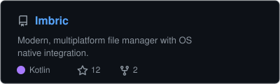
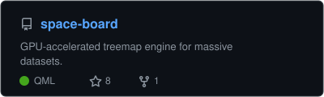
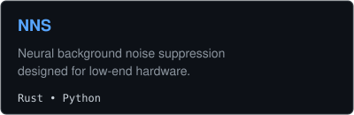
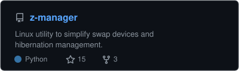

### Yash Kumar
**Software Developer | BCA Student**

Specializing in high-performance system utilities, multiplatform applications, and clean architecture. Focused on Kotlin, Python, Rust, and native OS integrations.

🎓 BCA Student | 📧 [yr9389121@gmail.com](mailto:yr9389121@gmail.com)

### 🛠️ Tech Stack

* **Languages:**      
* **Frameworks & Tools:**      
* **Environment:**  

### 🚀 Featured Projects

  
  
   
  
  

#### 📫 Connect & Contact
* **Email:** [yr9389121@gmail.com](mailto:yr9389121@gmail.com)
